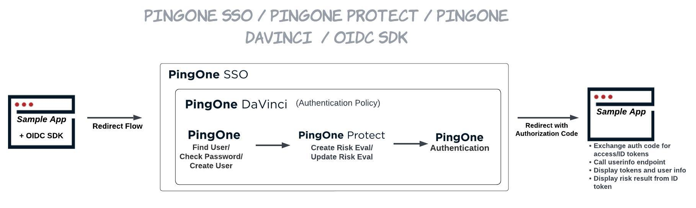

# Terraform + PingOne SSO + PingOne DaVinci + PingOne Protect + Signals SDK Sample App

## Prerequisites
- Terraform CLI installed on your computer, see [instructions](https://developer.hashicorp.com/terraform/downloads)
- License with PingOne DaVinci product enabled
- Configure a DaVinci Administrator environment in PingOne, see [Getting Stated - PingOne DaVinci](https://terraform.pingidentity.com/getting-started/davinci/)
- After you have created a DaVinci Administrator environment you will need create a Worker App in the environment (Connections > Applications)

## Use Case



This integration package combines Terraform, DaVinci, PingOne SSO, PingOne Protect, the Signals SDK, and the OIDC SDK to demonstrate user registration and authentication, as well as threat protection.

Terraform allows for easy and quick deployment of all platform configurations necessary to run this sample application. 

During the deployment process, Terraform will create a new PingOne environment with DaVinci, PingOne SSO, and PingOne Protect services enabled. The DaVinci environment gets created with a flow that demonstrates a registration and password authentication use case. In this flow, the Signals SDK is initiated in a custom HTML template, the response from the SDK is then sent in a call to the PingOne Protect API to create a risk evaluation. The sample application uses the OIDC SDK to initiate the authentication flow for the OIDC application in PingOne which uses a DaVinci policy created by Terraform. After the DaVinci flow is successfully completed, the user is redirected back to the sample app.

### Registration
1. Start the sample app and navigate to the URL provided.
2. Click on the link to Login and complete the username form. Click **Next**.
3. If a user with this username does not already exist in PingOne Directory, a registration form will be presented.
4. Fill out all fields of the registration form, click **Register**. The user will get created and will land on the /dashboard endpoint. The email used to register will be displayed on the dashboard page, as well as the user's tokens, user info, and risk score.
5.. Click **Logout** to return to the homepage and register a new user, or to demonstrate sign in. 

### Sign In as an Existing User
1. Start the sample app and navigate to the URL provided.
2. Complete the registration instructions above to create a new user, if you have not already done so. 
3. Click on the link to Login and complete the username form with the user created in step 2. Click **Next**.
3. Fill in the user's password. Click **Sign On**.
4. You will be signed in and landed on the /dashboard endpoint. The email used to login will be displayed on the dashboard page, as well as the user's tokens, user info, and risk score.
4. Click **Logout** to return to the homepage and register a new user, or to demonstrate sign in. 

## Source Code Folders

### /davinci-sso-protect-pkg/davinci-sso-protect-sample-app

| File | Contents |
| ------ | -------- |
| index.html | Sample application home page |
| dashboard.html | Sample application dashboard page post login |
| global.js | PingOne DaVinci environment variables. To be generated by Terraform |

| Folder | Contents |
| ------ | -------- |
| /certs | Self-signed certificate and private key |
| /css | CSS files |
| /fonts | Font files |
| /images | UI assets |

### /davinci-sso-protect-pkg/terraform

| File | Contents |
| ---- | -------- |
| .terraform | Terraform [working directory](https://developer.hashicorp.com/terraform/cli/init#working-directory-contents) created by Terraform. Never touch this. It's managed by Terraform. You won't see this until you run `terraform init`. |
| .terraform.lock.hcl | The Terraform [dependency lock file](https://developer.hashicorp.com/terraform/language/files/dependency-lock). Where Terraform manages the versions of the downloaded providers or modules. Never touch this. It's managed by Terraform. If you need to update versions, see [-upgrade option](https://developer.hashicorp.com/terraform/language/files/dependency-lock#dependency-installation-behavior). You won't see this until you run `terraform init`. |
| data.tf | HCL for doing [data](https://developer.hashicorp.com/terraform/language/data-sources) lookups/reads on data in your environment/infrastructure. |
| main.tf | HCL for necessary [providers](https://developer.hashicorp.com/terraform/language/providers) and [modules](https://developer.hashicorp.com/terraform/language/modules). |
| outputs.tf | HCL declaring [output values](https://developer.hashicorp.com/terraform/language/values/outputs) that are the result of dynamic data. In this case, the deployed apps URL. |
| resources.tf | HCL that declares all the [resources](https://developer.hashicorp.com/terraform/language/resources) we need to create in our environment/infrastructure. The things you normally create by clicking around the PingOne admin console manually. |
| terraform.tfstate | The [Terraform state](https://developer.hashicorp.com/terraform/language/state) file. This is where Terraform manages the "state" of your infrastructure and compares that against your deployed infrastructure. Never touch this. It's managed by Terraform. |
| terraform.tfvars | [Variable definitions](https://developer.hashicorp.com/terraform/language/values/variables#variable-definitions-tfvars-files), name/value pairs, that should not be part of your project repo and added dynamically during Terraform execution. This will not exist until you create it according to the instructions in the project-specific README. |
| vars.tf | HCL that declares [variables](https://developer.hashicorp.com/terraform/language/values/variables) that will be needed in defining your environment/infrastructure. |
| versions.tf | HCL declaring [required providers](https://developer.hashicorp.com/terraform/language/providers/requirements#requiring-providers) & versions to use. |


## Cloning the Project
### Variables
After cloning the project, navigate to `/davinci-sso-protect-pkg/terraform` and create a `terraform.tfvars` file with the following:

```hcl
region            = "{{ NorthAmerica | Canada | Asia | Europe }}"
organization_id   = "{{orgId}}"
admin_env_id      = "{{adminEnvId}}"
admin_user_id     = "{{adminUserId}}"
license_id        = "{{licenseId}}"
worker_id         = "{{workerId}}"
worker_secret     = "{{workerSecret}}"
admin_username    = "{{adminUsername}}"
admin_password    = "{{adminPassword}}"
```

| Variable | Description | 
| -------- | ----------- |
| region | Region for PingOne Environment | 
| organization_id | PingOne Organization Id - Located under Environment -> Properties | 
| admin_env_id | PingOne Environment Id for DaVinci Administrators Environment (see prerequisites) - Located under Environment -> Properties |
| admin_user_id | User Id for a user in the DaVinci Administrators Environment (see prerequisites) - Located under Identities -> Users -> Select user -> Click API tab -> ID |
| license_id | License Id to be used for PingOne Environment |
| worker_id | Client Id for Worker App in the DaVinci Administrators Environment (see prerequisites) - Located under Connections -> Applications -> Select existing Worker App or create one -> Configuration -> Expand General -> Client ID |
| worker_secret | Client Secret for Worker App in the DaVinci Administrators Environment (see prerequisites) - Located under Connections -> Applications -> Select Worker App -> Configuration -> Expand General -> Client Secret |
| admin_username | Username for DaVinci admin user (see prerequisites) |
| admin_password | Password for DaVinci admin user (see prerequisites) |

### Deployment

##### Deploy PingOne Environment

In the command line, navigate to the `terraform` directory and run:

```code
export PINGONE_REGION="{{ NorthAmerica | Canada | Asia | Europe }}"
terraform init
terraform plan
```

If the plan fails - check your `terraform.tfvars` values.

If the plan succeeds:

```code
terraform apply --auto-approve
````

Your new PingOne environment is called: `DaVinci SSO Protect Example`

If any errors are encountered, please ensure you are using the latest version of the provider by running `terraform init -upgrade`

##### Deploy DaVinci SSO Protect Sample Application

In the command line, navigate to the `davinci-sso-protect-app` directory and run:

```code
npx http-server -S -C certs/cert.pem -K certs/key.pem
```

Access the sample application at:
https://127.0.0.1:8080

View [http-server](https://www.npmjs.com/package/http-server) documentation for additional server options.

# Disclaimer
THIS DEMO AND SAMPLE CODE IS PROVIDED "AS IS" AND ANY EXPRESS OR IMPLIED WARRANTIES, INCLUDING THE IMPLIED WARRANTIES OF MERCHANTABILITY AND FITNESS FOR A PARTICULAR PURPOSE ARE DISCLAIMED. IN NO EVENT SHALL PING IDENTITY OR CONTRIBUTORS BE LIABLE FOR ANY DIRECT, INDIRECT, INCIDENTAL, SPECIAL, EXEMPLARY, OR CONSEQUENTIAL DAMAGES (INCLUDING, BUT NOT LIMITED TO, PROCUREMENT OF SUBSTITUTE GOODS OR SERVICES; LOSS OF USE, DATA, OR PROFITS; OR BUSINESS INTERRUPTION) SUSTAINED BY YOU OR A THIRD PARTY, HOWEVER CAUSED AND ON ANY THEORY OF LIABILITY, WHETHER IN CONTRACT, STRICT LIABILITY, OR TORT ARISING IN ANY WAY OUT OF THE USE OF THIS DEMO AND SAMPLE CODE, EVEN IF ADVISED OF THE POSSIBILITY OF SUCH DAMAGE.