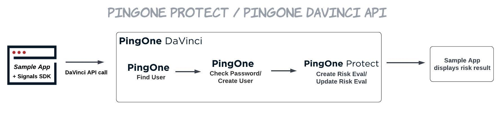

# Terraform + PingOne DaVinci API + PingOne Protect + Signals SDK Sample App

## Prerequisites

- Terraform CLI installed on your computer, see [instructions](https://developer.hashicorp.com/terraform/downloads)
- License with PingOne DaVinci product enabled
- Configure a DaVinci Administrator environment in PingOne, see [Getting Started - PingOne DaVinci](https://terraform.pingidentity.com/getting-started/davinci/)
- After you have created a DaVinci Administrator environment you will need create a Worker App in the environment (Connections > Applications)

## Use Case



This integration package combines Terraform, DaVinci, PingOne Protect, and the Signals SDK to demonstrate user registration and authentication, as well as threat protection.

Terraform allows for easy and quick deployment of all platform configurations necessary to run this sample application.

During the deployment process, Terraform will create a new PingOne environment with DaVinci and PingOne Protect services enabled. The DaVinci environment gets created with a flow that demonstrates a registration and password authentication use case. In this flow, a risk evaluation is created by a call made to the PingOne Protect APIs. The sample application initializes the Signals SDK and sends the risk payload to DaVinci to be used in the risk evaluation call when registration or authentication is initiated.

### Registration

1. Start the sample app and navigate to the URL provided.
2. Complete the registration form with an email address and password. Click **Submit**.
3. If a user with this password does not already exist in PingOne Directory, the user will get created and will land on the /dashboard endpoint. The email used to register will be displayed on the dashboard page, as well as the risk score and response received from the PingOne Protect API for this transaction.
4. Click **Logout** to return to the homepage and register a new user, or to demonstrate sign in.

### Sign In as an Existing User

1. Start the sample app and navigate to the URL provided.
2. Complete the registration instructions above to create a new user, if you have not already done so.
3. Complete the form with the credentials for the user created in step 2. Click **Submit**.
4. You will be signed in and landed on the /dashboard endpoint. The email used to login will be displayed on the dashboard page, as well as the risk score and response received from the PingOne Protect API for this transaction.
5. Click **Logout** to return to the homepage and register a new user, or to demonstrate sign in.

## Source Code Folders

### /sample-app

| File           | Contents                                                            |
| -------------- | ------------------------------------------------------------------- |
| index.html     | Sample application home page                                        |
| dashboard.html | Sample application dashboard page post login                        |
| global.js      | PingOne DaVinci environment variables. To be generated by Terraform |

| Folder  | Contents                                |
| ------- | --------------------------------------- |
| /certs  | Self-signed certificate and private key |
| /css    | CSS files                               |
| /fonts  | Font files                              |
| /images | UI assets                               |

### /terraform

| File                | Contents                                                                                                                                                                                                                                                                                                                                                                                                                                                       |
| ------------------- | -------------------------------------------------------------------------------------------------------------------------------------------------------------------------------------------------------------------------------------------------------------------------------------------------------------------------------------------------------------------------------------------------------------------------------------------------------------- |
| .terraform          | Terraform [working directory](https://developer.hashicorp.com/terraform/cli/init#working-directory-contents) created by Terraform. Never touch this. It's managed by Terraform. You won't see this until you run `terraform init`.                                                                                                                                                                                                                             |
| .terraform.lock.hcl | The Terraform [dependency lock file](https://developer.hashicorp.com/terraform/language/files/dependency-lock). Where Terraform manages the versions of the downloaded providers or modules. Never touch this. It's managed by Terraform. If you need to update versions, see [-upgrade option](https://developer.hashicorp.com/terraform/language/files/dependency-lock#dependency-installation-behavior). You won't see this until you run `terraform init`. |
| data.tf             | HCL for doing [data](https://developer.hashicorp.com/terraform/language/data-sources) lookups/reads on data in your environment/infrastructure.                                                                                                                                                                                                                                                                                                                |
| main.tf             | HCL for necessary [providers](https://developer.hashicorp.com/terraform/language/providers) and [modules](https://developer.hashicorp.com/terraform/language/modules).                                                                                                                                                                                                                                                                                         |
| outputs.tf          | HCL declaring [output values](https://developer.hashicorp.com/terraform/language/values/outputs) that are the result of dynamic data. In this case, the deployed apps URL.                                                                                                                                                                                                                                                                                     |
| resources.tf        | HCL that declares all the [resources](https://developer.hashicorp.com/terraform/language/resources) we need to create in our environment/infrastructure. The things you normally create by clicking around the PingOne admin console manually.                                                                                                                                                                                                                 |
| terraform.tfstate   | The [Terraform state](https://developer.hashicorp.com/terraform/language/state) file. This is where Terraform manages the "state" of your infrastructure and compares that against your deployed infrastructure. Never touch this. It's managed by Terraform.                                                                                                                                                                                                  |
| terraform.tfvars    | [Variable definitions](https://developer.hashicorp.com/terraform/language/values/variables#variable-definitions-tfvars-files), name/value pairs, that should not be part of your project repo and added dynamically during Terraform execution. This will not exist until you create it according to the instructions in the project-specific README.                                                                                                          |
| vars.tf             | HCL that declares [variables](https://developer.hashicorp.com/terraform/language/values/variables) that will be needed in defining your environment/infrastructure.                                                                                                                                                                                                                                                                                            |
| versions.tf         | HCL declaring [required providers](https://developer.hashicorp.com/terraform/language/providers/requirements#requiring-providers) & versions to use.                                                                                                                                                                                                                                                                                                           |

## Cloning the Project

### Variables

After cloning the project, navigate to the `/terraform` folder and create a `terraform.tfvars` file with the following:

```hcl
pingone_environment_id = "{{adminEnvId}}"

region_code   = "{{ NA | CA | AP | AU | EU }}"
admin_user_id = "{{adminUserId}}"
license_id    = "{{licenseId}}"
worker_id     = "{{workerId}}"
worker_secret = "{{workerSecret}}"

dv_admin_region      = "{{ NorthAmerica | Canada | AsiaPacific | Europe }}"
dv_admin_username    = "{{adminUsername}}"
dv_admin_password    = "{{adminPassword}}"
davinci_admin_group  = "{{dvAdminGroup}}"
assign_dv_admin_role = true | false
```

| Variable               | Description                                                                                                                                                                                                                    |
| ---------------------- | ------------------------------------------------------------------------------------------------------------------------------------------------------------------------------------------------------------------------------ |
| pingone_environment_id | PingOne Environment Id for DaVinci Administrators Environment (see prerequisites) - Located under Environment -> Properties                                                                                                    |
| region_code            | Region code for PingOne Environment                                                                                                                                                                                            |
| admin_user_id          | User Id for a user in the DaVinci Administrators Environment (see prerequisites) - Located under Identities -> Users -> Select user -> Click API tab -> ID                                                                     |
| license_id             | License Id to be used for PingOne Environment                                                                                                                                                                                  |
| worker_id              | Client Id for Worker App in the DaVinci Administrators Environment (see prerequisites) - Located under Connections -> Applications -> Select existing Worker App or create one -> Configuration -> Expand General -> Client ID |
| worker_secret          | Client Secret for Worker App in the DaVinci Administrators Environment (see prerequisites) - Located under Connections -> Applications -> Select Worker App -> Configuration -> Expand General -> Client Secret                |
| dv_admin_region        | Region for PingOne DaVinci Environment                                                                                                                                                                                         |
| dv_admin_username      | Username for DaVinci admin user (see prerequisites)                                                                                                                                                                            |
| dv_admin_password      | Password for DaVinci admin user (see prerequisites)                                                                                                                                                                            |
| davinci_admin_group    | Name of the group that has DaVinci Admin rights. The default is "DaVinci Terraform Administrators" (see prerequisites)                                                                                                         |
| assign_dv_admin_role   | Assign DaVinci Admin role to new environment. If your DaVinci Admin group is scoped to organization set this to false. The default is true                                                                                     |

### Deployment

##### Deploy PingOne Environment

In the command line, navigate to the `/terraform` folder and run:

```code
export PINGONE_REGION="{{ NorthAmerica | Canada | AsiaPacific | Europe }}"
terraform init
terraform plan
```

If the plan fails - check your `terraform.tfvars` values.

If the plan succeeds:

```code
terraform apply --auto-approve
```

Your new PingOne environment is called: `DaVinci API Protect Example`

##### Deploy the Sample Application

In the command line, navigate to the `/sample-app` folder and run:

```code
npx http-server -S -C certs/cert.pem -K certs/key.pem
```

Access the sample application at:
https://127.0.0.1:8080

View [http-server](https://www.npmjs.com/package/http-server) documentation for additional server options.

# Disclaimer

THIS DEMO AND SAMPLE CODE IS PROVIDED "AS IS" AND ANY EXPRESS OR IMPLIED WARRANTIES, INCLUDING THE IMPLIED WARRANTIES OF MERCHANTABILITY AND FITNESS FOR A PARTICULAR PURPOSE ARE DISCLAIMED. IN NO EVENT SHALL PING IDENTITY OR CONTRIBUTORS BE LIABLE FOR ANY DIRECT, INDIRECT, INCIDENTAL, SPECIAL, EXEMPLARY, OR CONSEQUENTIAL DAMAGES (INCLUDING, BUT NOT LIMITED TO, PROCUREMENT OF SUBSTITUTE GOODS OR SERVICES; LOSS OF USE, DATA, OR PROFITS; OR BUSINESS INTERRUPTION) SUSTAINED BY YOU OR A THIRD PARTY, HOWEVER CAUSED AND ON ANY THEORY OF LIABILITY, WHETHER IN CONTRACT, STRICT LIABILITY, OR TORT ARISING IN ANY WAY OUT OF THE USE OF THIS DEMO AND SAMPLE CODE, EVEN IF ADVISED OF THE POSSIBILITY OF SUCH DAMAGE.
