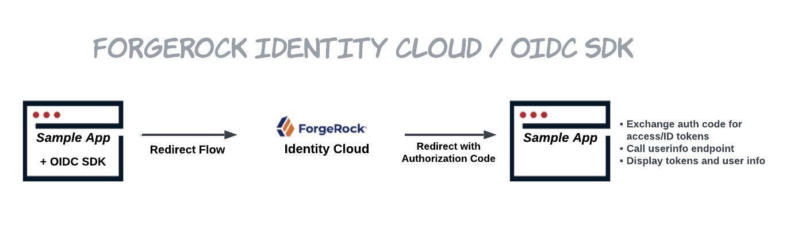

# OIDC SDK + Identity Cloud Sample App Package

## Use Case



This integration package combines Identity Cloud and the OIDC SDK to demonstrate user registration and authentication.

When authentication is initiated from the sample app, the OIDC SDK is used to redirect the user to the authorization endpoint in your Identity Cloud tenant. The user returns to the sample app after successful authentication, and the SDK stores their tokens in storage and displays them to the user.

### Prerequisites

##### Identity Cloud Tenant
You must have an Identity Cloud tenant. If you do not have access to an Identity Cloud tenant and would like more information about ForgeRock Identity Solutions fill out our [Contact Us](https://www.forgerock.com/contact-us-2) form to get started.

##### OAuth2 Client
Add a custom application to your Identity Cloud tenant. See [Register a custom application](https://backstage.forgerock.com/docs/idcloud/latest/app-management/register-a-custom-application.html) for more information.
1. Sign-in Method: OIDC - OpenID Connect
2. Application Type: Native SPA

Update your application with the following configuration settings:

| Config Setting | Value |
| -------------- | ----- |
| Sign-in URLs | https://localhost:8080/dashboard.html |
| Sign-out URLs | https://localhost:8080/index.html |
| Scopes | openid email profile |
| Token Endpoint Authentication Method | none |
| Client Type | Public |
| Implied Consent | checked |

##### Configure CORS
You must add a CORS configuration and add the `authorization` header. Refer to the [latest CORS documentation](https://backstage.forgerock.com/docs/idcloud/latest/tenants/configure-cors.html).

### Deploy OIDC Sample Application

#### global.js
Update the global.js file in the sample-app folder with your Identity Cloud tenant specific values.

| Key      | Value |
| -------- | ----- |
| clientId | Your OAuth2 Client ID|
| wellKnownUrl | Your authorization server's well-known endpoint |

### Registration
1. Start the sample app and navigate to the URL provided.
2. Click on the link to Login. Click **Create an account**
3. Complete all fields of the registration form, click **Next**. 
4. Go to your inbox and click on the link **Email verification link**. The user will get created and will land on the /dashboard endpoint. The user's access token, id token, and user info will be displayed on the dashboard page.
5. Click **Logout** to return to the homepage and register a new user, or to demonstrate sign in. 

### Sign In as an Existing User
1. Start the sample app and navigate to the URL provided.
2. Complete the registration instructions above to create a new user, if you have not already done so. 
3. Click on the link to Login and fill in the credentials for the user created in step 2. Click **Next**. You will be signed in and landed on the /dashboard endpoint. The user's access token, id token, and user info will be displayed on the dashboard page.
4. Click **Logout** to return to the homepage and register a new user, or to demonstrate sign in. 

## Source Code Folders

### /sample-app

| File | Contents |
| ------ | -------- |
| index.html | Sample application home page |
| dashboard.html | Log-in protected page |
| global.js | Identity Cloud environment variables. To be populated with your tenant specific values.|

| Folder | Contents |
| ------ | -------- |
| /certs | Self-signed certificate and private key |
| /css | CSS files |
| /images | UI assets |
| /js | JavaScript files needed to support tabs user interface |

In the command line, navigate to the `/sample-app` directory and run:

```code
npx http-server -S -C certs/cert.pem -K certs/key.pem -a localhost
```

Access the sample application at:
https://localhost:8080

View [http-server](https://www.npmjs.com/package/http-server) documentation for additional server options.

# Disclaimer
THIS DEMO AND SAMPLE CODE IS PROVIDED "AS IS" AND ANY EXPRESS OR IMPLIED WARRANTIES, INCLUDING THE IMPLIED WARRANTIES OF MERCHANTABILITY AND FITNESS FOR A PARTICULAR PURPOSE ARE DISCLAIMED. IN NO EVENT SHALL PING IDENTITY OR CONTRIBUTORS BE LIABLE FOR ANY DIRECT, INDIRECT, INCIDENTAL, SPECIAL, EXEMPLARY, OR CONSEQUENTIAL DAMAGES (INCLUDING, BUT NOT LIMITED TO, PROCUREMENT OF SUBSTITUTE GOODS OR SERVICES; LOSS OF USE, DATA, OR PROFITS; OR BUSINESS INTERRUPTION) SUSTAINED BY YOU OR A THIRD PARTY, HOWEVER CAUSED AND ON ANY THEORY OF LIABILITY, WHETHER IN CONTRACT, STRICT LIABILITY, OR TORT ARISING IN ANY WAY OUT OF THE USE OF THIS DEMO AND SAMPLE CODE, EVEN IF ADVISED OF THE POSSIBILITY OF SUCH DAMAGE.