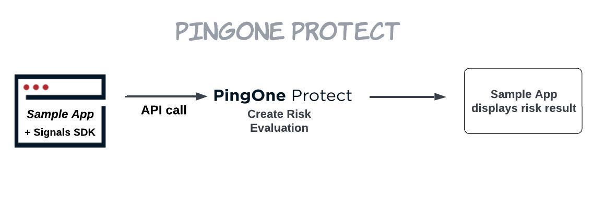

# PingOne Protect + Terraform + PingOne Sample App Package

## Use Case



This integration package combines Terraform, PingOne Protect, and the Signals SDK to demonstrate threat detection capabilities.

Terraform allows for easy and quick deployment of all platform configurations necessary to run this sample application. 

During the deployment process, Terraform will create a new PingOne environment with the PingOne Protect service enabled. Terraform also creates a demo user in PingOne to test with. When a risk evaluation is requested, the Signals SDK is initialized and an API call is made directly to the PingOne Protect APIs, the risk result is then displayed onscreen.

### Get Risk Evaluation
1. Start the sample app and navigate to the URL provided.
2. Click **Get Risk Evaluation**. The details of the risk result will be displayed onscreen. The first attempt will likely come back as high risk due to the New Device risk predictor, subsequent attempts should score differently. Navigate to the **Details** tab to view more information on the risk score. 
3. Click **New Risk Evaluation** to get your updated risk score.

## Source Code Folders

### /sample-app

| File | Contents |
| ------ | -------- |
| /server.js | Server-side API, used to send risk data to PingOne and pass result back to client |
| /.env | PingOne environment variables. To be generated by Terraform |
| /public/index.html | Sample application home page |

| Folder | Contents |
| ------ | -------- |
| /public/certs | Self-signed certificate and private key |
| /public/css | CSS files |
| /public/images | UI assets |
| /public/js | JavaScript files needed to support tabs user interface |

### /terraform

| File | Contents |
| ---- | -------- |
| .terraform | Terraform [working directory](https://developer.hashicorp.com/terraform/cli/init#working-directory-contents) created by Terraform. Never touch this. It's managed by Terraform. You won't see this until you run `terraform init`. |
| .terraform.lock.hcl | The Terraform [dependency lock file](https://developer.hashicorp.com/terraform/language/files/dependency-lock). Where Terraform manages the versions of the downloaded providers or modules. Never touch this. It's managed by Terraform. If you need to update versions, see [-upgrade option](https://developer.hashicorp.com/terraform/language/files/dependency-lock#dependency-installation-behavior). You won't see this until you run `terraform init`. |
| data.tf | HCL for doing [data](https://developer.hashicorp.com/terraform/language/data-sources) lookups/reads on data in your environment/infrastructure. |
| main.tf | HCL for necessary [providers](https://developer.hashicorp.com/terraform/language/providers) and [modules](https://developer.hashicorp.com/terraform/language/modules). |
| outputs.tf | HCL declaring [output values](https://developer.hashicorp.com/terraform/language/values/outputs) that are the result of dynamic data. In this case, the deployed apps URL. |
| resources.tf | HCL that declares all the [resources](https://developer.hashicorp.com/terraform/language/resources) we need to create in our environment/infrastructure. The things you normally create by clicking around the PingOne admin console manually. |
| terraform.tfstate | The [Terraform state](https://developer.hashicorp.com/terraform/language/state) file. This is where Terraform manages the "state" of your infrastructure and compares that against your deployed infrastructure. Never touch this. It's managed by Terraform. |
| terraform.tfvars | [Variable definitions](https://developer.hashicorp.com/terraform/language/values/variables#variable-definitions-tfvars-files), name/value pairs, that should not be part of your project repo and added dynamically during Terraform execution. This will not exist until you create it according to the instructions in the project-specific README. |
| vars.tf | HCL that declares [variables](https://developer.hashicorp.com/terraform/language/values/variables) that will be needed in defining your environment/infrastructure. |
| versions.tf | HCL declaring [required providers](https://developer.hashicorp.com/terraform/language/providers/requirements#requiring-providers) & versions to use. |


## Getting Started
Install Terraform on your machine, following the instructions [here](https://developer.hashicorp.com/terraform/downloads).

## Cloning the Project
### Variables
After cloning the project, navigate to `/terraform` and create a `terraform.tfvars` file with the following:

```hcl
pingone_environment_id    = "{{adminEnvId}}"

region          = "{{ NorthAmerica | Canada | Asia | Europe }}"
admin_user_id   = "{{adminUserId}}"
license_id      = "{{licenseId}}"
worker_id       = "{{workerId}}"
worker_secret   = "{{workerSecret}}"
```

| Variable | Description | 
| -------- | ----------- |
| pingone_environment_id | PingOne Environment Id for Administrators Environment - Located under Environment -> Properties |
| region | Region for PingOne Environment | 
| admin_user_id | User Id for a user in the Administrators Environment - Located under Identities -> Users -> Select user -> Click API tab -> ID |
| license_id | License Id to be used for PingOne Environment |
| worker_id | Client Id for Worker App in the Administrators Environment - Located under Connections -> Applications -> Select existing Worker App or create one -> Configuration -> Expand General -> Client ID |
| worker_secret | Client Secret for Worker App in the Administrators Environment - Located under Connections -> Applications -> Select Worker App -> Configuration -> Expand General -> Client Secret |

### Deployment

##### Deploy PingOne Environment

In the command line, navigate to the `/terraform` directory and run:

```code
export PINGONE_REGION="{{ NorthAmerica | Canada | Asia | Europe }}"
terraform init
terraform plan
```

If the plan fails - check your `terraform.tfvars` values.

If the plan succeeds:

```code
terraform apply --auto-approve
````

Your new PingOne environment is called: `Protect API Example`

If any errors are encountered, please ensure you are using the latest version of the provider by running `terraform init -upgrade`

##### Deploy PingOne Protect Sample Application

In the command line, navigate to the `/sample-app` directory and run:

```code
npm install

npm start
```

Access the sample application at:
https://127.0.0.1:8080

View [http-server](https://www.npmjs.com/package/http-server) documentation for additional server options.

Note: Terraform will add a user to PingOne with a username of demouser1, you can use this to get a risk assessment for a PingOne user, any other username will generate a risk assessment for an `EXTERNAL` user.

##### Deploy Using an Existing PingOne Environment
If you prefer not to use Terraform to create a PingOne environment for you, you can configure this package to use an existing PingOne environment by following the instructions below.

Navigate to the `/ping-one-protect-sample-app` directory and add a .env file with the following values (see .env.template in the same directory):

| Variable | Description | 
| -------- | ----------- |
| P1_ENV_ID | PingOne Environment Id |
| P1_DOMAIN | PingOne Top-Level Domain (com, eu, ca, asia)  |
| P1_WORKER_CLIENT_ID | Worker app client Id |
| P1_WORKER_CLIENT_SECRET | Worker app client secret |

Note: The Administrators environment cannot be used for this.

In the command line, navigate to the `/sample-app` directory and run:

```code
npm install

npm start
```

Access the sample application at:
https://0.0.0.0:8080 or https://127.0.0.1:8080


# Disclaimer
THIS DEMO AND SAMPLE CODE IS PROVIDED "AS IS" AND ANY EXPRESS OR IMPLIED WARRANTIES, INCLUDING THE IMPLIED WARRANTIES OF MERCHANTABILITY AND FITNESS FOR A PARTICULAR PURPOSE ARE DISCLAIMED. IN NO EVENT SHALL PING IDENTITY OR CONTRIBUTORS BE LIABLE FOR ANY DIRECT, INDIRECT, INCIDENTAL, SPECIAL, EXEMPLARY, OR CONSEQUENTIAL DAMAGES (INCLUDING, BUT NOT LIMITED TO, PROCUREMENT OF SUBSTITUTE GOODS OR SERVICES; LOSS OF USE, DATA, OR PROFITS; OR BUSINESS INTERRUPTION) SUSTAINED BY YOU OR A THIRD PARTY, HOWEVER CAUSED AND ON ANY THEORY OF LIABILITY, WHETHER IN CONTRACT, STRICT LIABILITY, OR TORT ARISING IN ANY WAY OUT OF THE USE OF THIS DEMO AND SAMPLE CODE, EVEN IF ADVISED OF THE POSSIBILITY OF SUCH DAMAGE.